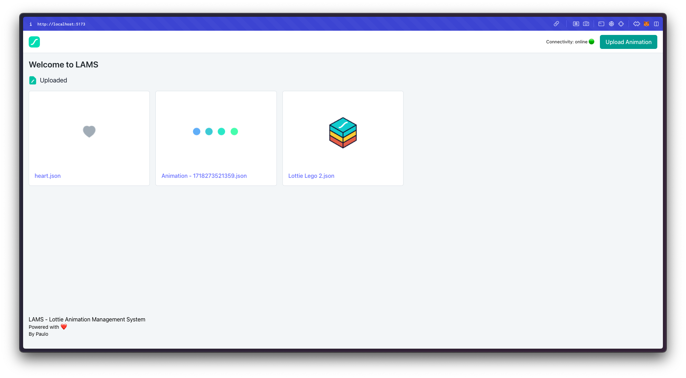
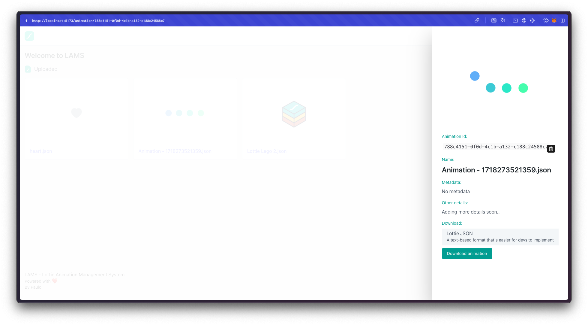
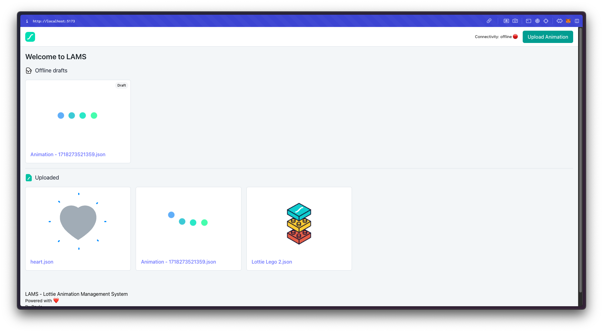
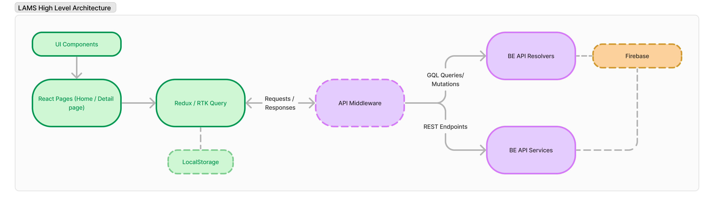
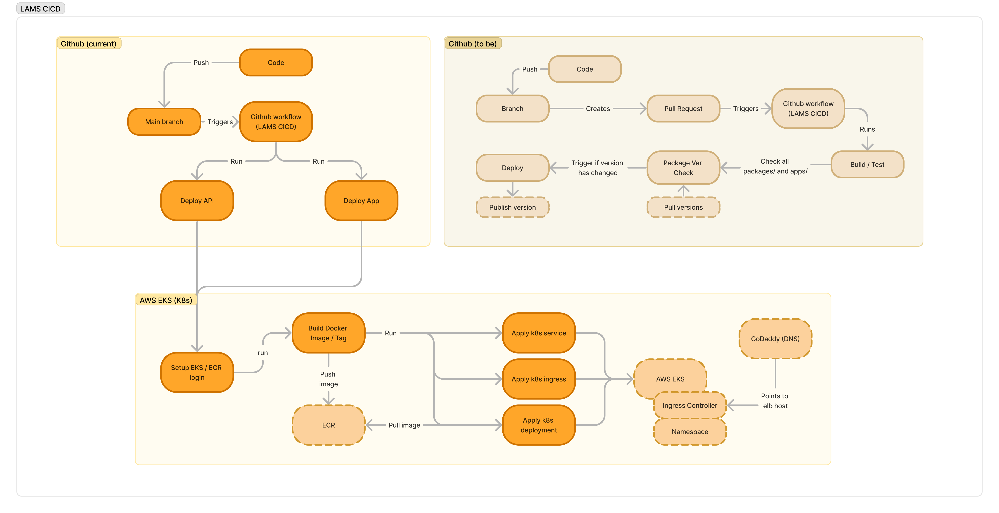

# LAMS
## 🚀 Animation Management System (Lottie) - Technical Test

### Overview
The Lottie Animation Management System (LAMS) is a web application that allows users to fetch, preview, upload, and download Lottie animations. The application provides robust offline capabilities, allowing users to interact with animations and access animation details even when no internet connection is available.

### TODO Checklist
- [x] Turborepo setup
- [x] Lottie App - frontend (Vite Setup)  
- [x] Lottie Api - backend (Express + Graphql Setup)  
- [x] Firebase / Firestore API setup for backend 
- [x] Client Caching
- [x] PWA 
- [x] Grapqhl APIs and integration
- [x] Redux - RTK and RTK Query
- [x] Client Routing - React Router V6
- [x] TS typings 
- [x] Offline queue for uploaded animations 
- [x] Offline list for fetching animations 
- [x] Get Animation by Id
- [x] Get Animations
- [x] Upload Animation
- [ ] Search Animation
- [x] Download Animation
- [x] Deployment

### Demo

#### Test URL
https://dev-app.lams.appwwwards.com/

#### Video
[](https://drive.google.com/file/d/1nK4ONu4SMjimB05HfxKvVzHCRuFbqIjE/preview)

#### Screenshots




### Architecture


### Tech stack
- Turborepo: It simplifies managing multiple projects within a single repository. It leverages caching and parallel processing to significantly speed up build times. It allows you to share configurations, scripts, and utility functions across multiple projects
- Redux, RTK: Simplifies state management with a structured and predictable state container.
- React Router v6: Provides powerful and flexible routing for single-page applications.
- Tailwind CSS: Utility-first CSS framework for rapid UI development.
- Workbox: Enables advanced caching and offline capabilities for Progressive Web Apps (PWAs).
- Express: Fast, unopinionated, minimalist web framework for Node.js.
- GraphQL: Allows clients to request only the data they need, making APIs more efficient.
- Firebase: Provides real-time database and file storage with easy integration and scalability.
- Framer Motion: A production-ready motion library for React to create animations.
- LocalStorage: Provides local caching of data

#### Backend
- Node.js
- Express
- GraphQL, Apollo
- Firebase
- Please see backend documentation [here](./apps/lottie-api/README.md)

#### Frontend
- React
- Redux, RTK, Apollo
- React Router v6
- Tailwind CSS
- Workbox
- Framer Motion
- Vite
- Please see frontend documentation [here](./apps/lottie-app/README.md)

#### Project Structure
```
lottie/
├── apps/
│   ├── lottie-api/ -- contains all backend api related tasks
│   └── lottie-app/ -- contains all frontend related tasks
├── packages/
│   ├── eslint-config/
│   ├── tailwind-config/
│   └── typescript-config/
├── .turbo/
├── node_modules/
├── package.json
├── turbo.json
└── README.md
```

#### Apps and Packages

- `lottie-app`: a Vite SPA/PWA
- `lottie-api`: a ExpressJS api
- `eslint-config`: `eslint` configurations 
- `typescript-config`: `tsconfig.json`s used throughout the monorepo
- `tailwind-config`: `tailwind.config.js`s used for tailwind configurations

Each package/app is 100% [TypeScript](https://www.typescriptlang.org/).

### Build

To install all apps and packages, run the following command in the root, you may also go to their individual directory eg. `cd apps/lottie-app` and run the command:

```
pnpm install
```

### Develop

To develop all apps and packages, run the following command in the root, you may also go to their individual directory eg. `cd apps/lottie-app` and run the command:

```
pnpm dev
```

### Build

To build all apps and packages, run the following command in the root:

```
pnpm build
```

### CICD
Utilising Github Actions and Workflow for a simple CI/CD.
- AWS 
- Elastic Kubernetes Service
- Docker / ECR
- Github Actions / Workflow
- GoDaddy - subdomain from existing DNS


