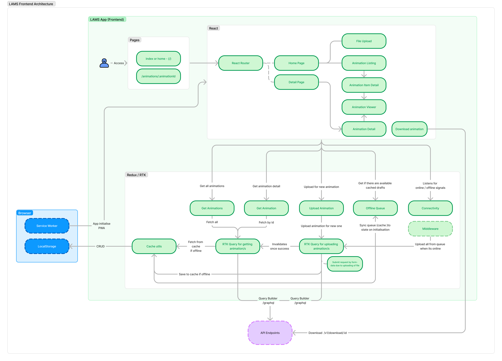

# LAMS - Frontend (APP)

## Overview

The FE of this web app is built using React, with additional libraries and tools such as Vite, Redux Toolkit, Tailwind CSS, React Router V6, Workbox, and Framer Motion to create a robust, offline-first Lottie Animation Management System. The goal is to provide users with the ability to fetch, preview, upload, and download Lottie animations, with detailed metadata and offline capabilities.

## Architecure


## Technologies
- React: Core library for building user interfaces.
- Vite: Fast build tool and development server.
- Redux Toolkit (RTK): State management with an emphasis on simplicity and efficiency.
- Tailwind CSS: Utility-first CSS framework for styling.
- React Router: For navigation and routing.
- Workbox: For enhancing offline capabilities and PWA features.
- React Lottie: For Lottie animation preview.
- Framer Motion: For animations and transitions.

## FE Project Structure
```
lottie-app/
├── .env
├── .env.staging
├── index.html
├── package.json
├── postcss.config.js
├── public/
├── src/
│   ├── assets/ -- logos, icons and etc
│   ├── components/ -- all atomic and compound components including hooks
│   ├── pages/ -- page components such as homepage and animation detail page
│   ├── rdx/ -- all features pertaining to graphql, store, reducers and actions
│   ├── utils/ -- other misc js utility functions
│   ├── main.jsx
│   └── ... (other files)
├── tailwind.config.js
└── vite.config.js

```

## Capabilities
### State Management with Redux Toolkit
The application state is managed using Redux Toolkit, which includes slices and a custom middleware for handling offline uploads.

### GraphQL
GraphQL is used to define the API schema and handle queries and mutations related to animations, such as fetching animations, uploading, and etc. Apollo client to help construct these queries and mutations

### Tailwind CSS for Styling
Tailwind CSS is used to style the app's components efficiently with utility classes. Mimicking the `app.lottiefiles.com` base styling.

### Offline Capabilities with Workbox
Workbox was used to enhance the offline capabilities of the app, ensuring that it can be interacted with animations and access detailed metadata even when offline.

### PWA Features
The application includes a service worker and PWA manifest to make it installable and provide a better offline experience.

### File Upload
The application allows to upload animation files, which are cached locally and sent to the backend when online.

### Routes

- `/`: Home page listing animations.
- `/animation/:id`: Detailed view of a specific animation.

### Components
- `animation/<AnimationList />`: Component to list all animations available handles the logic of rendering queue and online based animations
- `animation/<AnimationItemDetail />`: Component to compliment `<AnimationList />` especially with rendering item detail
- `animation/<AnimationViewer />`: Used to preview animation using `React Lottie` library
- `<FileUpload />`: Handles the button and logic of uploading animation, it also helps on the offline capability especially on the uploading in queue if offline

### Redux features
- `rdx/features/animations`: Contains slices `animation.slice`, `offlineQueue.slice`, actions and etc - this feature plays a vital role on the data handling and animation state logic of the app
- `rdx/features/connectivity`: This handles the online and offline signals for the app
- `rdx/services/gql` - This service holds the `graphql` related stuffs
    - uses RTK Query for simplified redux state management
    - `GetAnimations`, `GetAnimation`, `UploadAnimation` and etc
    - It also helps to sync between offline and online data flow

### Things to improve
- [ ] Create mini UI library to handle component system, themes, and UI config, this is also to minimise repeatition of codes esp function components and class names
- [ ] Handle error within the app
- [ ] Add Create animation flow not just upload but able to add more details like other fields and etc
- [ ] Encrypt localstorage items, once a record is stored then decrypt when viewing or being uploaded to backend
- [ ] Implement user session
- [ ] Improve `types` esp with `TODO`s
- [ ] Tailwind extend config with more tokens
- [ ] Implement search mechanism
- [ ] Improve Routing capabilities esp with page transitions
- [ ] Replace `fetch` w `axios` this is more for network capabilities such as interceptors, abort signals and etc.
- [ ] and more..